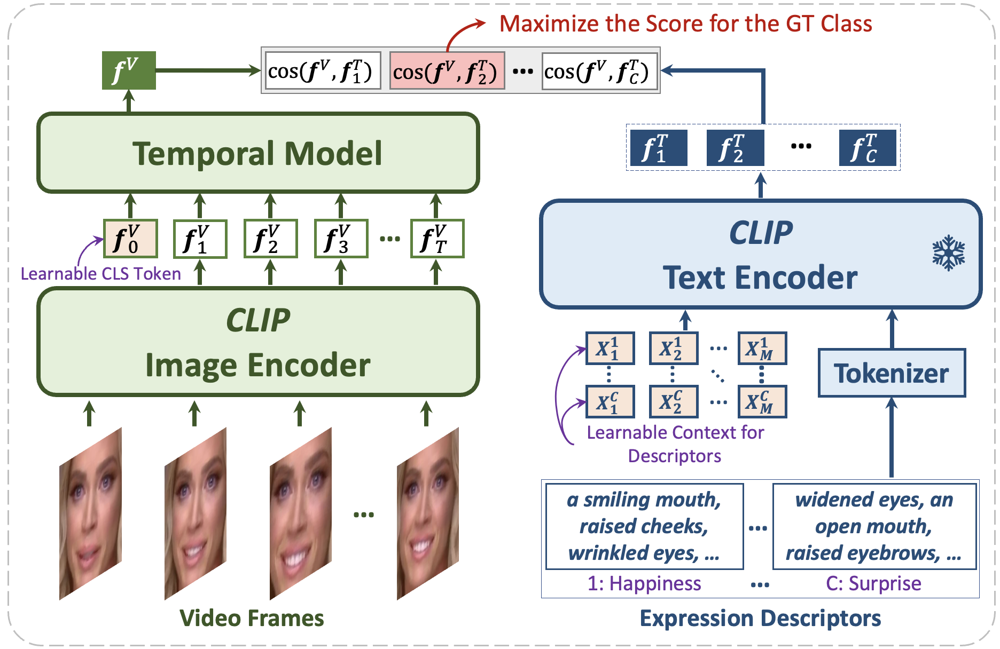

# DFER-CLIP: Prompting Visual-Language Models for Dynamic Facial Expression Recognition

<p align="center">
    
</p>

This is a PyTorch implementation of the paper:

*Zengqun Zhao, Ioannis Patras. "[Prompting Visual-Language Models for Dynamic Facial Expression Recognition](https://arxiv.org/abs/2308.13382)", British Machine Vision Conference (BMVC), 2023.*

### Abstract
This paper presents a novel visual-language model called DFER-CLIP, which is based on the CLIP model and designed for in-the-wild Dynamic Facial Expression Recognition (DFER). Specifically, the proposed DFER-CLIP consists of a visual part and a textual part. For the visual part, based on the CLIP image encoder, a temporal model consisting of several Transformer encoders is introduced for extracting temporal facial expression features, and the final feature embedding is obtained as a learnable "class" token. For the textual part, we use as inputs textual descriptions of the facial behaviour that is related to the classes (facial expressions) that we are interested in recognising -- those descriptions are generated using large language models, like ChatGPT. This, in contrast to works that use only the class names and more accurately captures the relationship between them. Alongside the textual description, we introduce a learnable token which helps the model learn relevant context information for each expression during training. Extensive experiments demonstrate the effectiveness of the proposed method and show that our DFER-CLIP also achieves state-of-the-art results compared with the current supervised DFER methods on the DFEW, FERV39k, and MAFW benchmarks.

## Requirement
The code is built with following libraries: **PyTorch, scikit-learn, einops, matplotlib, numpy, math, shutil, tqdm**

Extra setup is required for data preprocessing. Please refer to [preprocessing](./annotation/preprocessing.py).

## Training
We use the weight provided by OpenCLIP as the starting point for our training.

``` train_DFEW.sh ```, ``` train_FERV3k.sh ```, and ``` train_MAFW.sh ``` are for running on corresponding dataset. 

## Test (Pre-trained Models)
The pre-trained models on DFEW five folds can be downloaded at [fold_1](https://drive.google.com/file/d/1tH1d2zZv2HtcQFPrGuVWJHXmD9sTeddQ/view?usp=drive_link), [fold_2](https://drive.google.com/file/d/1w6yESY3cNwcOCwQa-dTxIHNWBv57PRUR/view?usp=drive_link), [fold_3](https://drive.google.com/file/d/1kmI1XlZdQIr6R33tBdteyrmYl0UgyXv8/view?usp=drive_link), [fold_4](https://drive.google.com/file/d/10pxe7fCtASuKaxpZSGb7nR6EAjN7YSR6/view?usp=drive_link), and [fold_5](https://drive.google.com/file/d/161pNBUgR_uPSvptzN4ZI4_L7-tvF9SD8/view?usp=drive_link), respectively.

The pre-trained model on FERV39k can be downloaded at [here](https://drive.google.com/file/d/1lRUw5eTa7TGSEombjHqCPE76oP2c_3fz/view?usp=drive_link).

The pre-trained models on MAFW five folds can be downloaded at [fold_1](https://drive.google.com/file/d/1vaICPQ9g3gfYpEcRwej6Se5qRb0LzbP6/view?usp=drive_link), [fold_2](https://drive.google.com/file/d/1NCJU33j7yr6t_RXJeR1pO_znrN_jV5EC/view?usp=drive_link), [fold_3](https://drive.google.com/file/d/12MS8ZVh582n2j37zy2Z7V85IwcnxuKC4/view?usp=drive_link), [fold_4](https://drive.google.com/file/d/1Zs6pkzPU2Wkqb5ykrTU-csiu_c8Tpggh/view?usp=drive_link), and [fold_5](https://drive.google.com/file/d/1txju5MPe2eODw98Uz16iG3vxTR1GLMrx/view?usp=drive_link), respectively.

## Performance
Performance on DFEW, FERV39k, and MAFW benchmarks:

<p align="center">
    
</p>

UAR: Unweighted Average Recall (the accuracy per class divided by the number of classes without considering the number of
instances per class); WAR: Weighted Average Recall (accuracy)

## Citation
If you find our work useful, please consider citing our paper:
```
@inproceedings{zhao2023dferclip,
  title={Prompting Visual-Language Models for Dynamic Facial Expression Recognition},
  author={Zhao, Zengqun and Patras, Ioannis},
  booktitle={British Machine Vision Conference (BMVC)},
  pages={1--14},
  year={2023}
}
```

## Acknowledgments
Our code is based on [CLIP](https://github.com/openai/CLIP) and [CoOp](https://github.com/KaiyangZhou/CoOp).
